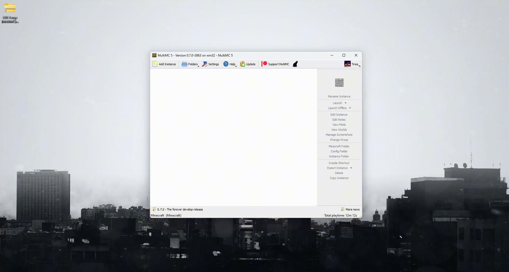
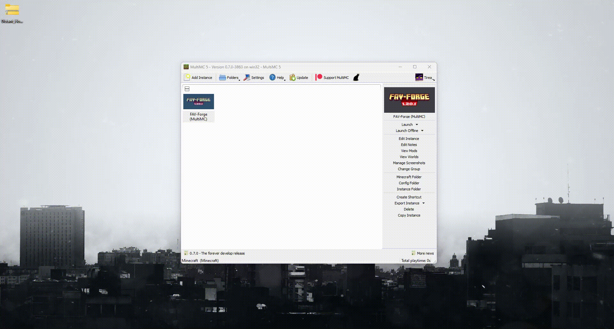

## Table of Contents

- [About the Modpack](#about-the-modpack)
- [Requirements](#requirements)
  - [Minimum](#minimum)
  - [Recommended](#recommended)
- [Installation](#installation)
  - [Java](#java)
- [Distant Horizons Server Data](#distant-horizons-server-data)
- [Reporting Issues](#reporting-issues)

# About the Modpack

FAV-Forge provides a large beautiful world with many new structures for you to explore, and some new tools to _create_ factories and farms to automate anything you could need.

Check out the entire [modlist](modlist.md)

# Requirements

## Minimum

- 2 GB Memory
- 1.5 GB Storage

## Recommended

- 4 GB+ memory

# Installation

Download the [latest release](https://github.com/TomasTobrman/FAV-Forge/releases/latest) of the modpack

Make sure you are downloading the **correct version** for your launcher

This example is showing how to import a new modpack into the MultiMC launcher. Similar steps should work in other launchers.



## Java

Your launcher usually provides the correct Java version when you create a new instance.

If this is not the case for you, make sure to have at least **Java 17** installed on your system. Check your Java version by running the command below in a command prompt or a terminal.

```
$ java --version
```

# Distant Horizons Server Data

To use the provided distant horizons server data, download the separate zip file and extract the contents into the folder of your instance. This folder can be usually opened from your launcher.



You do not need this data to run the modpack, but it is recommended for those who would like to enjoy visual experience on the official server to the fullest, as it provides pregenerated LODs of the spawn area in a 2500 block radius.

# Reporting Issues

It is possible that issues arise during gameplay. If you experience any unwanted behavior or would like to recommend a change or an addition into the modpack, you can discuss these issues in the [Issues](https://github.com/TomasTobrman/FAV-Forge/issues) tab.
